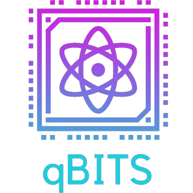

# qHackathon_Quest-2022


Quest is the BITS Goa chapter of Qiskit Fall Fest held from 25 to 27 November. Qiskit Fall Fests are quantum computing fests held globally on different campuses and are supported by IBM Quantum.  
<br>
We were given a task to make a simple Quantum Compile, which can apply basic Gates to the Qubit(s). You may read the problem statement in detail in the provided [PDF](/Quest%20qHackathon.pdf)
> **Note**
>If you are an absolute begginer in the world of Quantum, don't worry cause I got you covered, just go through the provided [PPT](/QC101_SK.pptx) to get a brief intro of the field.

## Pre-requisites
- Python 3.6 or later
- NumPy for Python 
  ```
  pip install numpy
  ```

## Features
- Support for Complex Amplitudes
- Initialize Qubits your way
- Friendly **CLI**
- View Matrix for supported Gates
- Gates supported :-
  - Pauli-X `X`
  - Pauli-Y `Y`
  - Pauli-Z `Z`
  - Hadamard `H`
  - Controlled Not `CNOT`

## Commands
